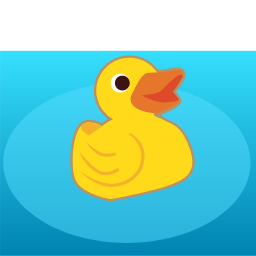

# StreamToy server
StreamToy is a framework for attaching a Godot based application and game to a streamer service to trigger actions in Godot when certain events in streams happen.

Currently, only Twitch is supported and supports subscriptions to all EventSub-API based event types as [documented on the Twitch API](https://dev.twitch.tv/docs/eventsub/eventsub-subscription-types).

**Warning**: StreamToy is in a very early stage. It works, but especially it's security implementations might not be as secure as possible. So please keep this in mind.

## Requirements

To work with the APIs of common streaming providers, the HTTP server part of the StreamToy servers requires to be accessible via HTTPS.

The supported container image can be used together with things like Kubernetes and cert-manager to automate using certificates from Let's Encrypt.

StreamToy needs to be available under two different API endpoints that point to different ports the container exports. Port 8080 is a standard HTTP port, Port 8081 is a websockets port, so websocket tunneling is required.

The following stanza from an Apache http server configuration gives an example of the required configuration:

```
ProxyPass /streamtoy ws://localhost:8081/
ProxyPassReverse /streamtoy ws://localhost:8081/
ProxyPass / http://localhost:8080/
ProxyPassReverse / http://localhost:8080/
```

This will make the StreamToy server available for the StreamToy client on https://streamtoy.example.com/streamtoy and for a streaming service under https://streamtoy.example.com/ (e.g. https://streamtoy.example.com/eventsub for Twitch)

## Usage

The StreamToy server is configured using environment variables. You can use the available docker image using

    docker run -e STREAMTOY_(...) --rm ghcr.io/deep-entertainment/godot-stream-toy:main

or directly run Godot on your local machine using

    STREAMTOY_(...) godot project.godot

## Configuration

The following environment variables are supported:

### Common configuration

- STREAMTOY_TEST: Enable test mode (see below) [not enabled]
- STREAMTOY_BIND_ADDRESS: The IP address to bind the server to or * to listen on every IPs [*]
- STREAMTOY_HTTP_PORT: The port the HTTP service will listen to [8080]
- STREAMTOY_PORT: The port the Godot WebSocket service service will listen to [8081]
- STREAMTOY_BASE_URL: The base URL of the HTTP server. Will be required to set if the server runs behind a reverse proxy [http://bind address:http port]
- STREAMTOY_TOKEN: The shared authentication token that will be used by clients to authenticate themselves before being allowed to use the StreamToy API
- STREAMTOY_CLIENT_TIMEOUT: The timeout after which a client will be forcibly disconnected if it didn't send a hearbeat ping [300]

### Twitch configuration

If you need to connect to twitch, the following environment variables are supported:

- STREAMTOY_TWITCH_API_TOKEN: The API token to connect to the twitch API
- STREAMTOY_TWITCH_API_CLIENT_ID: The API client ID to connect to the twitch API
- STREAMTOY_TWITCH_SECRET: A secret that will be used to validate the messages send back and forth with the twitch API

# Concept

The following diagram shows the basic concept behind StreamToy:


The following components are included:

- The viewers watch a broadcast produced by something like OBS
- The game using the StreamToy frontend subscribes to a range of Twitch events by calling a method on the StreamToy server, which is connected to it using the Godot ENET library.
- The StreamToy server sends out the requested subscription as HTTP requests to the Twitch API and handles the responses.
- If a viewer follows the channel, they indirectly use the Twitch API, which sends out a webhook to the http part of the StreamToy server
- The StreamToy server checks out its recorded subscriptions and notifies the game using the StreamToy frontend of the event
- The game using the StreamToy frontend reacts to the signal by e.g. showing an animation  using Godot's AnimationPlayer.
- The game is running as a web export with a transparent backend, which is used in a web frame in OBS

# Issues

See the [deep entertainment issues repository](https://github.com/deep-entertainment/issues/issues) if you have problems or new ideas for the project.
